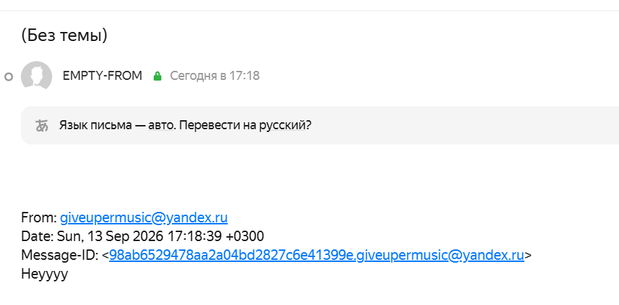
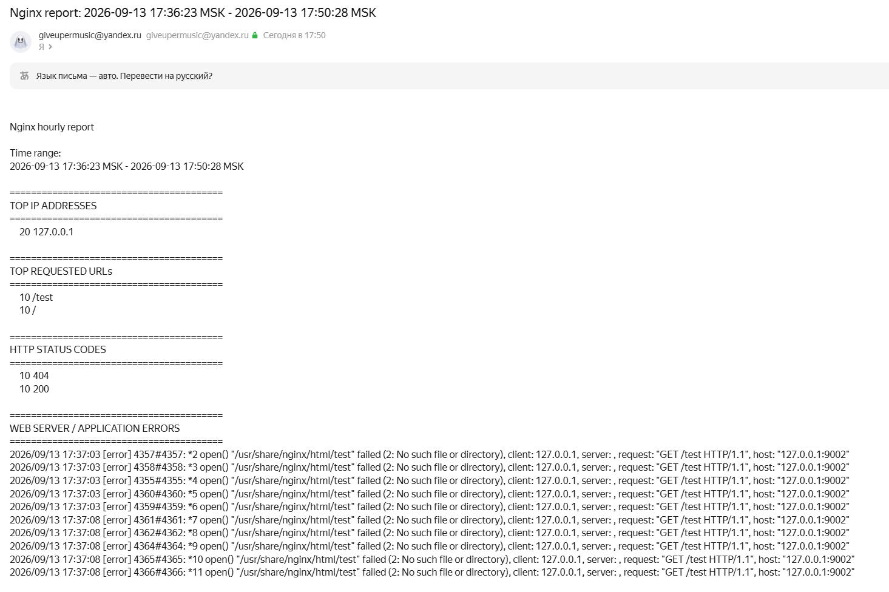

# Homework 9: Bash

## Task

### Create a cron script, that forms a report once an hour and sends it on email using SMTP

## Prerequisites

OS: **Ubuntu 24.04**

## Solution

### 0. Install cron, smpt and other dependencies and check, that nginx is working

```sh
❯ sudo tail /var/log/nginx/access.log
127.0.0.1 - - [13/Sep/2026:16:56:21 +0300] "GET /test HTTP/1.1" 404 162 "-" "curl/8.5.0"
127.0.0.1 - - [13/Sep/2026:16:56:26 +0300] "GET / HTTP/1.1" 200 615 "-" "curl/8.5.0"

❯ sudo apt update && sudo apt install cron msmtp msmtp-mta mailutils -y

❯ sudo systemctl enable --now cron
Synchronizing state of cron.service with SysV service script with /usr/lib/systemd/systemd-sysv-install.
Executing: /usr/lib/systemd/systemd-sysv-install enable cron
```

### 1. Configure SMTP using yandex mail server

Add `/etc/msmtprc` with yandex smtp config and modify permissions

```sh
❯ cat /etc/msmtprc
defaults
auth on
tls on
tls_starttls off
tls_certcheck on
tls_trust_file /etc/ssl/certs/ca-certificates.crt


account yandex
host smtp.yandex.com
port 465
from giveupermusic@yandex.ru
user giveupermusic@yandex.ru
password <REDACTED>

account default : yandex

❯ sudo chmod 600 /etc/msmtprc
```

Then validate it works

```sh
❯ echo "Heyyyy" | msmtp giveupermusic@yandex.ru
```



### 2. Create nginx-report script

Add default env variables

```sh
❯ cat /etc/default/nginx-report
MAIL_TO="giveupermusic@yandex.ru"
ACCESS_LOG="/var/log/nginx/access.log"
ERROR_LOG="/var/log/nginx/error.log"
TOP_N=10

❯ sudo nano /opt/nginx-report.sh
❯ sudo chmod +x /opt/nginx-report.sh
```

The script itself is in [script.sh](script.sh) - it contains lockfile, statefile and report generation with:

* IP addresses with the most requests sent
* URLs with the most requests
* Errors from web-server/app
* HTTP response codes with their quantity

### 3. Initialize the state and generate test data

```sh
❯ sudo /opt/nginx-report.sh --init

❯ sudo cat /var/lib/nginx-report.state
LAST_RUN=1789310183
ACCESS_LINES=2
ERROR_LINES=1

❯ for i in {1..10}; do
    curl -s http://127.0.0.1:9001/ > /dev/null
done
❯ for i in {1..5}; do
    curl -s http://127.0.0.1:9002/test > /dev/null
done
❯ for i in {1..5}; do
    curl -s http://127.0.0.1:9002/test > /dev/null
done
❯ sudo tail -n 20 /var/log/nginx/access.log
127.0.0.1 - - [13/Sep/2026:17:36:58 +0300] "GET / HTTP/1.1" 200 615 "-" "curl/8.5.0"
127.0.0.1 - - [13/Sep/2026:17:36:58 +0300] "GET / HTTP/1.1" 200 615 "-" "curl/8.5.0"
127.0.0.1 - - [13/Sep/2026:17:36:58 +0300] "GET / HTTP/1.1" 200 615 "-" "curl/8.5.0"
127.0.0.1 - - [13/Sep/2026:17:36:58 +0300] "GET / HTTP/1.1" 200 615 "-" "curl/8.5.0"
127.0.0.1 - - [13/Sep/2026:17:36:58 +0300] "GET / HTTP/1.1" 200 615 "-" "curl/8.5.0"
127.0.0.1 - - [13/Sep/2026:17:36:58 +0300] "GET / HTTP/1.1" 200 615 "-" "curl/8.5.0"
127.0.0.1 - - [13/Sep/2026:17:36:58 +0300] "GET / HTTP/1.1" 200 615 "-" "curl/8.5.0"
127.0.0.1 - - [13/Sep/2026:17:36:58 +0300] "GET / HTTP/1.1" 200 615 "-" "curl/8.5.0"
127.0.0.1 - - [13/Sep/2026:17:36:58 +0300] "GET / HTTP/1.1" 200 615 "-" "curl/8.5.0"
127.0.0.1 - - [13/Sep/2026:17:36:58 +0300] "GET / HTTP/1.1" 200 615 "-" "curl/8.5.0"
127.0.0.1 - - [13/Sep/2026:17:37:03 +0300] "GET /test HTTP/1.1" 404 162 "-" "curl/8.5.0"
127.0.0.1 - - [13/Sep/2026:17:37:03 +0300] "GET /test HTTP/1.1" 404 162 "-" "curl/8.5.0"
127.0.0.1 - - [13/Sep/2026:17:37:03 +0300] "GET /test HTTP/1.1" 404 162 "-" "curl/8.5.0"
127.0.0.1 - - [13/Sep/2026:17:37:03 +0300] "GET /test HTTP/1.1" 404 162 "-" "curl/8.5.0"
127.0.0.1 - - [13/Sep/2026:17:37:03 +0300] "GET /test HTTP/1.1" 404 162 "-" "curl/8.5.0"
127.0.0.1 - - [13/Sep/2026:17:37:08 +0300] "GET /test HTTP/1.1" 404 162 "-" "curl/8.5.0"
127.0.0.1 - - [13/Sep/2026:17:37:08 +0300] "GET /test HTTP/1.1" 404 162 "-" "curl/8.5.0"
127.0.0.1 - - [13/Sep/2026:17:37:08 +0300] "GET /test HTTP/1.1" 404 162 "-" "curl/8.5.0"
127.0.0.1 - - [13/Sep/2026:17:37:08 +0300] "GET /test HTTP/1.1" 404 162 "-" "curl/8.5.0"
127.0.0.1 - - [13/Sep/2026:17:37:08 +0300] "GET /test HTTP/1.1" 404 162 "-" "curl/8.5.0"
```

### 4. Validate the script works manually

```sh
❯ sudo cat /var/lib/nginx-report.state
LAST_RUN=1789311028
ACCESS_LINES=22
ERROR_LINES=11

❯ sudo /opt/nginx-report.sh

❯ sudo journalctl -t nginx-report -n 10 --no-pager
Sep 13 17:50:29 giveuperPC nginx-report[23074]: Report sent to giveupermusic@yandex.ru for range 2026-09-13 17:36:23 MSK - 2026-09-13 17:50:28 MSK
```



Then check that there are no old data in new report

```sh
❯ for i in {1..5}; do
    curl -s http://127.0.0.1:9002/test > /dev/null
done
❯ sudo cat /var/lib/nginx-report.state
LAST_RUN=1789311028
ACCESS_LINES=22
ERROR_LINES=11
❯ sudo /opt/nginx-report.sh
❯ sudo cat /var/lib/nginx-report.state
LAST_RUN=1789311357
ACCESS_LINES=27
ERROR_LINES=16
```

Report:

```
Nginx hourly report

Time range:
2026-09-13 17:50:28 MSK - 2026-09-13 17:55:57 MSK

========================================
TOP IP ADDRESSES
========================================
      5 127.0.0.1

========================================
TOP REQUESTED URLs
========================================
      5 /test

========================================
HTTP STATUS CODES
========================================
      5 404

========================================
WEB SERVER / APPLICATION ERRORS
========================================
2026/09/13 17:55:46 [error] 4367#4367: *12 open() "/usr/share/nginx/html/test" failed (2: No such file or directory), client: 127.0.0.1, server: , request: "GET /test HTTP/1.1", host: "127.0.0.1:9002"
2026/09/13 17:55:46 [error] 4356#4356: *13 open() "/usr/share/nginx/html/test" failed (2: No such file or directory), client: 127.0.0.1, server: , request: "GET /test HTTP/1.1", host: "127.0.0.1:9002"
2026/09/13 17:55:46 [error] 4356#4356: *14 open() "/usr/share/nginx/html/test" failed (2: No such file or directory), client: 127.0.0.1, server: , request: "GET /test HTTP/1.1", host: "127.0.0.1:9002"
2026/09/13 17:55:46 [error] 4356#4356: *15 open() "/usr/share/nginx/html/test" failed (2: No such file or directory), client: 127.0.0.1, server: , request: "GET /test HTTP/1.1", host: "127.0.0.1:9002"
2026/09/13 17:55:46 [error] 4356#4356: *16 open() "/usr/share/nginx/html/test" failed (2: No such file or directory), client: 127.0.0.1, server: , request: "GET /test HTTP/1.1", host: "127.0.0.1:9002"
```

Also check `flock` - two scripts cannot run in the same time

```sh
❯ sudo flock /run/nginx-report.lock sleep 60 &
[1] 26570

❯ sudo /opt/nginx-report.sh

❯ sudo journalctl -t nginx-report -n 5 --no-pager
Sep 13 18:01:49 giveuperPC nginx-report[26606]: Another instance is already running
```

### 5. Add cron job to run every minute for test

```sh
❯ cat /etc/cron.d/nginx-report
* * * * * root /opt/nginx-report.sh

❯ sudo chmod 644 /etc/cron.d/nginx-report
```

(the real cron schedule is `0 * * * *`)

Validate it's working

```sh
❯ journalctl -u cron --no-pager -f
Sep 13 18:07:01 giveuperPC CRON[28236]: (root) CMD (/opt/nginx-report.sh)
Sep 13 18:07:02 giveuperPC nginx-report[28256]: Report sent to giveupermusic@yandex.ru for range 2026-09-13 17:55:57 MSK - 2026-09-13 18:07:01 MSK
Sep 13 18:07:02 giveuperPC CRON[28235]: pam_unix(cron:session): session closed for user root
Sep 13 18:07:02 giveuperPC systemd[1]: Stopping cron.service - Regular background program processing daemon...
Sep 13 18:07:02 giveuperPC systemd[1]: cron.service: Deactivated successfully.
Sep 13 18:07:02 giveuperPC systemd[1]: Stopped cron.service - Regular background program processing daemon.
Sep 13 18:07:02 giveuperPC (cron)[28266]: cron.service: Referenced but unset environment variable evaluates to an empty string: EXTRA_OPTS
Sep 13 18:07:02 giveuperPC systemd[1]: Started cron.service - Regular background program processing daemon.
Sep 13 18:07:02 giveuperPC cron[28266]: (CRON) INFO (pidfile fd = 3)
Sep 13 18:07:02 giveuperPC cron[28266]: (CRON) INFO (Skipping @reboot jobs -- not system startup)
Sep 13 18:08:01 giveuperPC CRON[28660]: pam_unix(cron:session): session opened for user root(uid=0) by root(uid=0)
Sep 13 18:08:01 giveuperPC CRON[28661]: (root) CMD (/opt/nginx-report.sh)
Sep 13 18:08:01 giveuperPC nginx-report[28679]: Report sent to giveupermusic@yandex.ru for range 2026-09-13 18:07:01 MSK - 2026-09-13 18:08:01 MSK
Sep 13 18:08:01 giveuperPC CRON[28660]: pam_unix(cron:session): session closed for user root
```


